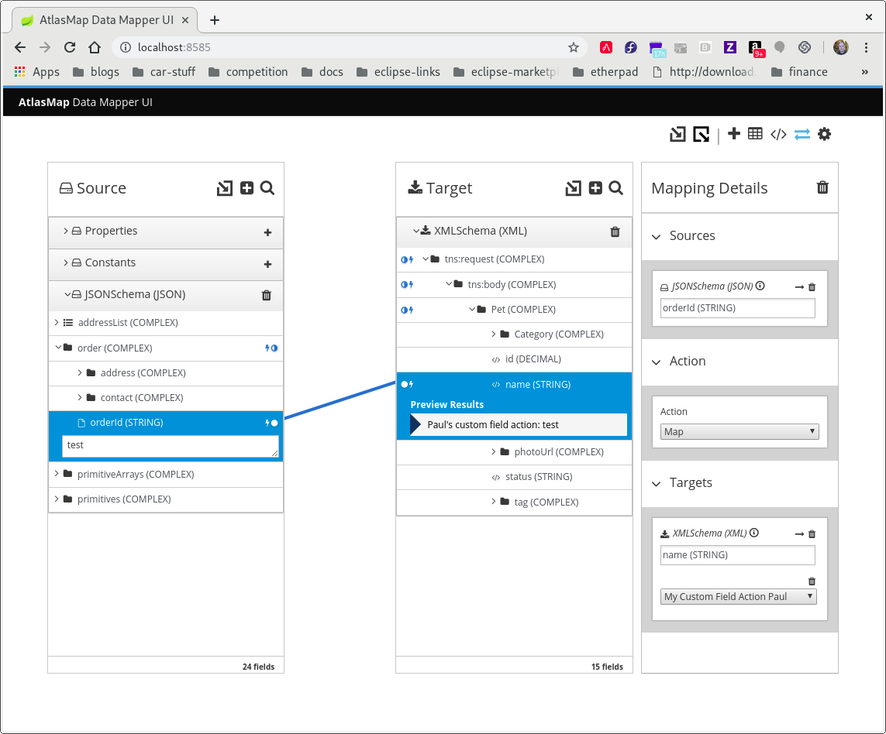

[id='creating-a-custom-transformation']
= Creating a custom transformation 

In addition to the built-in transformations, you can define custom field
action transformations. Write custom field actions in Java and then import them
into the AtlasMap data mapper. After it is established in a source or target 
panel, the transformation appears
in the list of transformations that are available for any field.  

.Procedure

. Define a transformation in Java.
+
The following custom transformation is applicable to `String` arguments.  
It takes the argument specified in the source panel
transformation and prints it on the target side with the string 'concur-'
and the user-specified concur parameter.
Implement the `AtlasFieldAction` class as follows:
+
[source,java]
----
package io.atlasmap.service.my;

import java.io.Serializable;
import io.atlasmap.v2.*
import io.atlasmap.spi.AtlasFieldAction;
import io.atlasmap.spi.AtlasActionProcessor;

public class PaulsFieldActions implements AtlasFieldAction {

    public static class Concur extends Action implements Serializable {
        @AtlasActionProperty(title = "Pauls Concur Param", type = FieldType.STRING)
        public String concurarg = "-paul-";

    }

    @AtlasActionProcessor
    public static String concur(Concur action, String userInput) {
        return "concur-" + action.concurarg + userInput;
    }

}
----

. Build your Java archive file.
+
The `io.atlasmap.v2`, `io.atlasmap.api` and `io.atlasmap.spi` target 
dependencies are most easily resolved
through the use of a maven `pom.xml` file.  Use the same version number as 
the AtlasMap standalone JAR file that you previously downloaded.

. At the top of the AtlasMap main tool bar, click `AtlasMap > Import a Java archive (.jar)`
to import your Java archive file. 
+
image:../images/Trans3.png[Import a Java archive]

. Navigate to the JAR file that contains your custom transformation 
and select it.
+
image:../images/Trans4.png[Import custom field action JAR]
+
. In the *Mapping Details* panel, in the *Targets* section, 
select the transformation pull-down menu to see that your
custom transformation now appears as a selectable 
transformation. Select it.
+

image:../images/Trans7.png[Import custom field action JAR]
. To test your custom transformation:
.. In the *Mapping Details* panel transformation you just added, type the string `ball` in the `Pauls Concur Param` input text box.
+
.. In the AtlasMap main tool bar, click the mapping preview icon.
+

.. In the *Source* panel input field,  
type a string, for example, `bat`.  
.. Notice the same string in the 
*Preview Results* field in the target panel with `concur-ball` prepended. 
+

