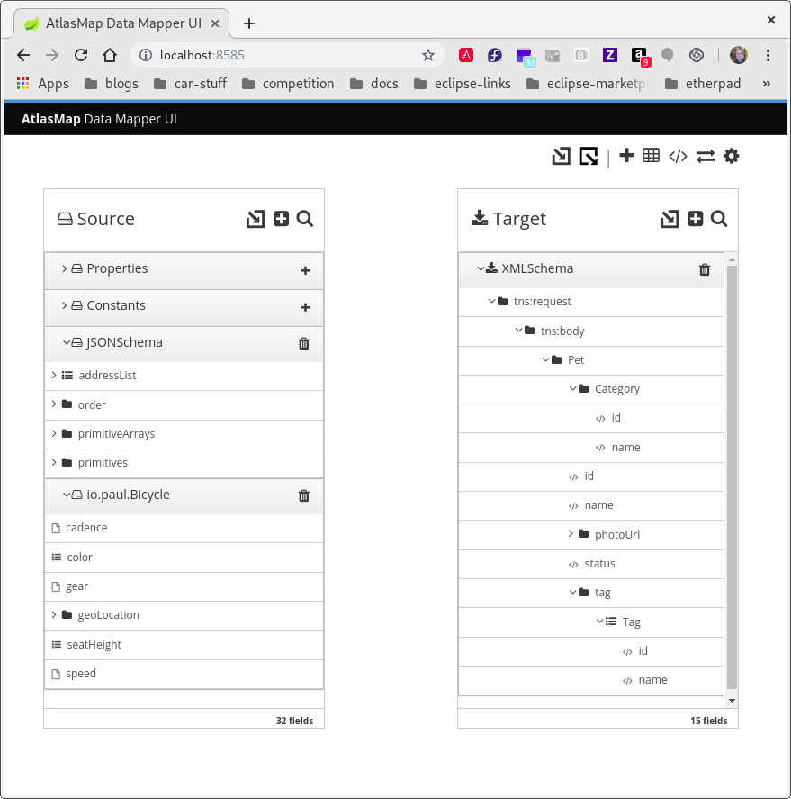

[id='importing-java-archive-files-into-atlasmap']
= Importing Java archive files into AtlasMap 

AtlasMap can import a Java archive file and display mappable fields in 
either the source or target panel. In the data mapper, each class-wide 
public entity in a class file that is in the imported JAR file becomes a 
mappable field. 

Arrays and data types are more discretely defined. 

Consider the following two files:  

[source,java]
----
Bicycle.java:

package io.paul;
import io.paul.GeoLocation;

public class Bicycle {
    public int cadence;
    public int gear;
    public int speed;
    public float[] seatHeight;
    public String[] color;
    public GeoLocation geoLocation;
}
----

[source,java]
----
GeoLocation.java:
package io.paul;

public class GeoLocation {
    double lattitude;
    double longitude;
}
----

To import these files: 

. Compile the Java files and assemble the results into a Java archive file. 
For example, invoke the following commands to create the `Bicycle.jar` file: 
+
----
javac -cp io.paul:. -d . GeoLocation.java Bicycle.java
jar cvf ../Bicycle.jar *
----

. In the main tool bar, click 
image:../images/Import-Data-Shape.png[Import].

. In the *Open* dialog, navigate to the `Bicycle.jar` file and click *Open*.
 
. At the top of the *Source* panel, click  
image:../images/PlusBlackBackground.png[+] 
to import the fields into the source panel. 
+
To display imported fields in the *Target* panel, you would click  
image:../images/PlusBlackBackground.png[+] 
at the top of the *Target* panel. 

. In the *Establish your class…* dialog, in the *Class package name* field, 
enter the class package name of the Java class. For example, in 
`Bicycle.jar` file, the class package name is `io.paul.Bicycle`. 

. Click *OK*.  If you import the sample `Bicycle.jar` file into the the 
*Source* panel, you would now see something like the following. 
The fields that are in the imported Java class files appear in the 
panel into which they were imported. 

